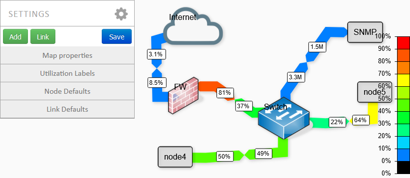

I needed a network map tool for my job...
networkmap.js had a good design, so I used it.

But it's buggy as HELL !

 
I corrected bugs and added a lot of functionality...
 
  

You can now :

- Add nodes / links in the interface.
- Save your networkmap
- Use multiple networkmap
- Do requests from your browser ( and the server when CORS is blocking the request )
- Request with SNMP, use .rrd file.
- Use a password to prevent unwanted changes
- Zoom and move the map (buggy when editing)
- Use images
- More soon...

   

It's an unfinished version, but it work WAY better than the original project.

Original project is here :

https://github.com/otm/networkmap.js

SVG set from : https://github.com/jb-stack/Dia-vrt-sheets
