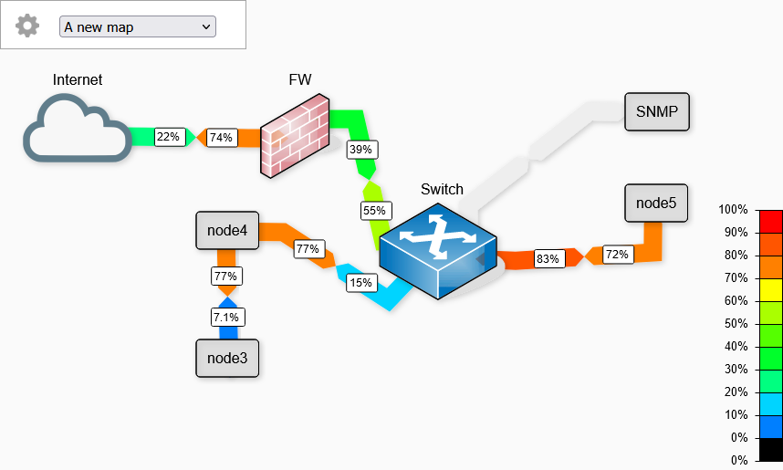

## weathermap network tool 





You can now :

- Create networkmaps
- Use multiple networkmaps
- Do requests from your browser ( and the server when CORS is blocking the request )
- Request with HTTP, SNMP, use .rrd file.
- Use a password to prevent unwanted changes
- Zoom and move the map (buggy when editing)
- Upload and use images

<br/>


## Install :

 - You need a webserver with PHP
 - PHP-SNMP if you want to use the SNMP

Move all the files from the src folder to you webserver.

These folders must be writable :
 - /img (to upload images)
 - /map (to save maps)
 - /oid_info (used to calculate bandwidth with SNMP)

## Use a password

Add your password in the config.php file :

```php
<?php

$password = "YOUR_PASSWORD_HERE";

```

Changelog May 2022 : Major debug + UI improvement


<br/><br/><br/>
SVG set from : https://github.com/jb-stack/Dia-vrt-sheets


Original project : [networkmap.js](https://github.com/otm/networkmap.js)

