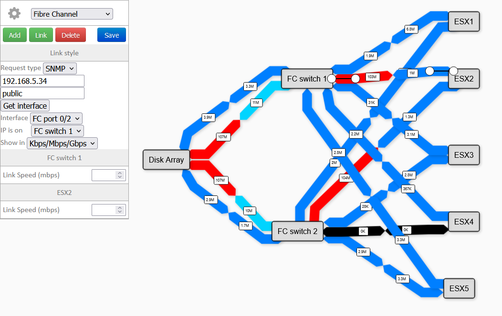

I needed a network map tool for my job... [networkmap.js](https://github.com/otm/networkmap.js) had a good design, so I used it.

But it's buggy as HELL !

<br/>
I corrected bugs and added a lot of features...
<br/>
<br/><br/>




You can now :

- Add nodes / links in the interface.
- Save your networkmap
- Use multiple networkmap
- Do requests from your browser ( and the server when CORS is blocking the request )
- Request with HTTP, SNMP, use .rrd file.
- Use a password to prevent unwanted changes
- Zoom and move the map (buggy when editing)
- Upload and use images
- More soon...

<br/>


## Install :

 - You need a webserver with PHP
 - PHP-SNMP if you want to use the SNMP

Move all the files from the src folder to you webserver.

These folders must be writable :
 - /img (to upload images)
 - /map (to save maps)
 - /oid_info (used to calculate bandwidth with SNMP)

## Use a password

Add your password in the config.php file :

```php
<?php

$password = "YOUR_PASSWORD_HERE";

```

## Use multiple maps :

At the end of the link, add the "map" argument followed by the map name :

ex : https://your.domain/networkmapjs/index.html?map=my_new_map

If it doesn't exist a new one will be created.

<br/><br/><br/>
SVG set from : https://github.com/jb-stack/Dia-vrt-sheets
